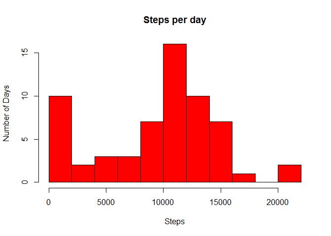
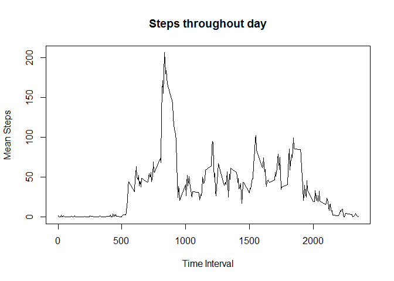
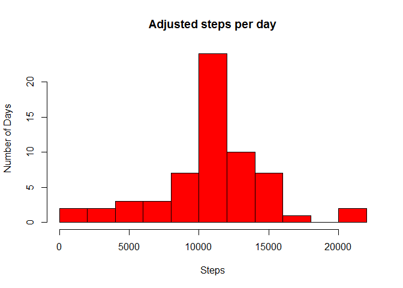
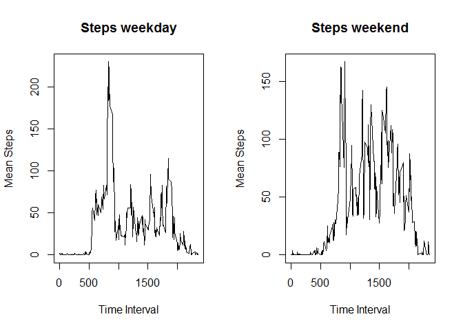

# Reproducible Research: Peer Assessment 1


## Loading and preprocessing the data

```r
actcsv <- unzip("./activity.zip")
act <- read.csv(actcsv)
byinterval <-factor(act, unique(act$interval), exclude = NA)
```

## What is mean total number of steps taken per day?

```r
stepsperday <- tapply(act$steps, act$date, sum, na.rm = T)
hist(stepsperday, main = "Steps per day", xlab = "Steps", ylab = "Number of Days", col = "Red", breaks = 15)
```

 

```r
mspd <- mean(stepsperday)
rmspd <- format(mspd, digits = 0, scientific = F)
mespd <- median(stepsperday)
rmespd <- format(mespd, digits = 0, scientific = F)
```

The mean number of steps per day is: 9354  
The median number of steps per day is: 10395  

## What is the average daily activity pattern?

```r
intstepsmean <- tapply(act$steps, act$interval, mean, na.rm = T)
ism <- as.numeric(intstepsmean)
int <- as.numeric(levels(byinterval))
plot(int, ism, type = 'l', main = "Steps throughout day", xlab = "Time Interval", ylab = "Mean Steps")
```

 

```r
timeint <- int[[which.max(ism)]]
```

The interval with the most steps on average is: 835


## Imputing missing values

```r
missrows <- sum(!complete.cases(act))
```
The total number of rows with missing values is: 2304

The missing values will be replaced with the mean for the corresponding time interval across all days.


```r
pos <- which(is.na(act), arr.ind = T)
ind <- match(act[pos, 3], int)
act1 <- act
act1[pos, 1] <- ism[ind]
```

Here is the adjusted histogram that with replacement values for all NA.


```r
stepsperday1 <- tapply(act1$steps, act1$date, sum, na.rm = T)
hist(stepsperday1, main = "Adjusted steps per day", xlab = "Steps", ylab = "Number of Days", col = "Red", breaks = 15)
```

 

```r
mspd1 <- mean(stepsperday1)
rmspd1 <- format(mspd1, digits = 0, scientific = F)
mespd1 <- median(stepsperday1)
rmespd1 <- format(mespd1, digits = 0, scientific = F)
```

The adjusted mean number of steps per day is: 10766  
The adjusted median number of steps per day is: 10766  


## Are there differences in activity patterns between weekdays and weekends?
This subsets the data into weekday and weekend.

```r
wd <- weekdays(as.Date(act1[, 2]))
wact1 <- cbind(act1, wd)
fact1 <- factor(wact1[, 4])
levels(fact1) <- c("weekday", "weekday", "weekend", "weekend", "weekday", "weekday", "weekday")
weekdact <- subset(wact1, fact1 == "weekday")
weekeact <- subset(wact1, fact1 == "weekend")
```

Here is a panel of two plots comparing mean steps across the course of a weekday or a weekend day.


```r
intstepsmeanwd <- tapply(weekdact$steps, weekdact$interval, mean, na.rm = T)
ismwd <- as.numeric(intstepsmeanwd)

intstepsmeanwe <- tapply(weekeact$steps, weekeact$interval, mean, na.rm = T)
ismwe <- as.numeric(intstepsmeanwe)

par(mfrow = c(1, 2))

plot(int, ismwd, type = 'l', main = "Steps weekday", xlab = "Time Interval", ylab = "Mean Steps")


plot(int, ismwe, type = 'l', main = "Steps weekend", xlab = "Time Interval", ylab = "Mean Steps")
```

 
